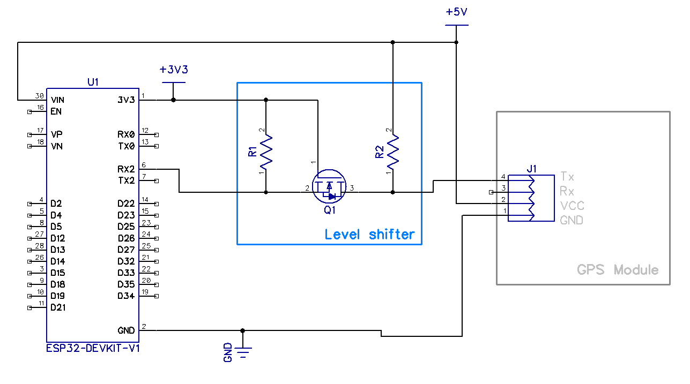

# GPS WiFi Server

An ESP32-based GPS data server that receives NMEA data from a GPS module and forwards it to clients over WiFi via TCP connection.

## Features

- **Dual WiFi Modes**: Can operate as Access Point or connect to existing WiFi network
- **Web Configuration Interface**: Easy setup through browser-based configuration
- **TCP GPS Data Streaming**: Real-time GPS data forwarding to connected clients
- **Persistent Configuration**: Settings saved to ESP32 flash memory
- **mDNS Support**: Easy access via `esp32.local` hostname
- **Automatic Fallback**: Falls back to AP mode if WiFi connection fails

## Hardware Requirements

- **ESP32 Development Board** (ESP32 DOIT DevKit v1 or compatible)
- **GPS Module** with UART output (e.g., NEO-6M, NEO-8M)
- **Connecting Wires**

## Wiring

Connect your GPS module to the ESP32 via Level Shifter. Actually level shifter might be not required in your case for your particular GPS module, but mine starts vomiting trash into UART after 3+ hours of working at 3.3V, so I decided to go with the level shifter.

Schematic is as follows:




If you decide to go without a level shifter, it's as simple as this:

| GPS Module | ESP32 Pin |
|------------|-----------|
| VCC        | 3.3V      |
| GND        | GND       |
| TX         | GPIO 16   |


## Software Requirements

- [PlatformIO](https://platformio.org/) IDE or extension
- ESP32 Arduino framework

## Installation

1. **Clone or download this project**
2. **Open in PlatformIO**
3. **Build and upload** to your ESP32:
   ```bash
   pio run --target upload
   ```
4. **Monitor serial output** (optional):
   ```bash
   pio device monitor
   ```

## Usage

### Initial Setup

1. **Power on the ESP32** - it will start in Access Point mode by default
2. **Connect to WiFi network** `ESP-GPS` from your device
3. **Open web browser** and navigate to:
   - `http://192.168.4.1` (AP mode)
   - `http://esp32.local` (if mDNS is supported)

### Configuration

The web interface allows you to configure:

- **WiFi Mode**: 
  - **Access Point**: ESP32 creates its own network
  - **Station**: ESP32 connects to existing WiFi
- **SSID**: WiFi network name
- **Password**: WiFi network password  
- **TCP Port**: Port for GPS data server (default: 5000)

### Accessing GPS Data

Once configured, GPS data can be accessed via TCP connection:

**Connection Details:**
- **Host**: ESP32's IP address
- **Port**: Configured TCP port (default: 5000)
- **Protocol**: TCP
- **Data Format**: Raw NMEA sentences

**Example using telnet:**
```bash
telnet <ESP32_IP> 5000
```

**Example using netcat:**
```bash
nc <ESP32_IP> 5000
```

### Web Interface Endpoints

- `/` - Main configuration page
- `/status` - View current status and IP information
- `/save` - Save configuration (POST)
- `/reset` - Factory reset (POST)

## Technical Details

### GPS Configuration
- **Baud Rate**: 115200
- **Data Format**: 8N1
- **UART Pins**: RX=16, TX=17

### Network Configuration
- **Web Server Port**: 80
- **Default TCP Port**: 5000
- **AP SSID**: "ESP-GPS"
- **mDNS Hostname**: "esp32.local"

### Data Flow
1. GPS module sends NMEA data via UART
2. ESP32 receives data on GPIO 16
3. Data is buffered and forwarded to connected TCP clients
4. Multiple clients can connect simultaneously

### Memory Usage
- Configuration stored in ESP32 NVS (Non-Volatile Storage)
- Buffer size: 128 bytes for GPS data

## Factory Reset

To perform a factory reset:
1. Access the web interface
2. Click "Factory Reset" button
3. ESP32 will reboot with default settings

## Troubleshooting

### WiFi Connection Issues
- ESP32 automatically falls back to AP mode if connection fails
- Check SSID and password in configuration
- Ensure WiFi network is within range

### No GPS Data
- Verify GPS module wiring
- Check GPS module has clear sky view for satellite lock
- Monitor serial output for debugging information

### Cannot Access Web Interface
- In AP mode: Connect to "ESP-GPS" network first
- In STA mode: Check ESP32's IP address from serial monitor
- Try accessing via `http://esp32.local`

## Development

Built with:
- **Platform**: ESP32 (Espressif32)
- **Framework**: Arduino
- **Board**: ESP32 DOIT DevKit v1

### Key Libraries Used
- `WiFi.h` - WiFi connectivity
- `WebServer.h` - HTTP server
- `Preferences.h` - Configuration storage
- `ESPmDNS.h` - mDNS hostname resolution
- `HardwareSerial.h` - UART communication

## License

This project is open source. Feel free to modify and distribute according to your needs.

## Contributing

Contributions are welcome! Please feel free to submit issues and pull requests.